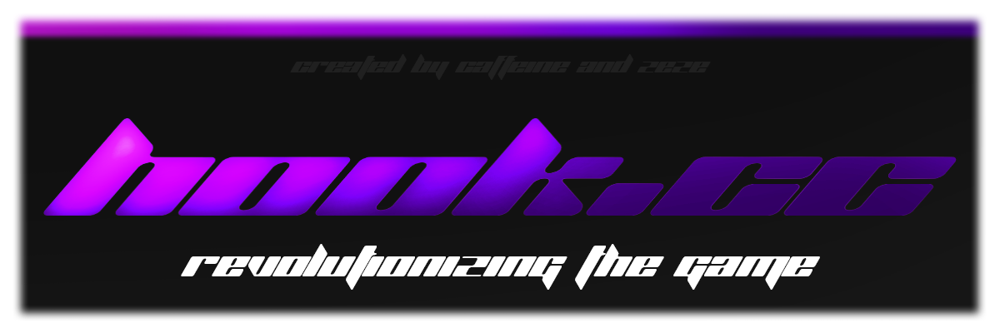

`hook.cc` is a safety-focused ui library for roblox scripts built with the main eye of security and stealth for its users

---

# ↓↓ TL:DR ↓↓

<details>
  <summary><strong> table of contents</strong></summary>

- [core ui features](#core-ui-features)  
- [available controls](#available-controls)  
- [control methods](#control-methods)  
- [config system](#config-system)  
- [security & runtime management](#security--runtime-management)  
- [example init](#example-init)  
- [usage](#usage)  
- [disclaimer](#disclaimer)

</details>

# ↑↑ TL:DR ↑↑

---

## core ui features

| feature                | description                                                                 |
|------------------------|-----------------------------------------------------------------------------|
| Drawing API-Based UI   | Uses `Drawing.new` for all rendering. Avoids `Instance.new`, `CoreGui`, and all Roblox UI instances for stealth. |
| Tab System             | Supports multiple tabbed panels, only one active at a time.                |
| Modular Controls       | Built-in support for buttons, labels, sliders, keybinds, and color pickers.|
| Clean Layout           | Consistent padding, spacing, and soft-edged square visuals.                |
| UI Dragging            | Reposition UI by dragging the top bar (via `UserInputService`).            |
| JSON Config Support    | Save/load tab state using `HttpService:JSONEncode` and `Decode`.           |

---

## available controls

```lua
local tab = CreateTab("main")
tab:AddLabel("hook.cc loaded")
tab:AddButton("run", function() print("clicked") end)
tab:AddSlider(0, 100, 50, function(v) print("value:", v) end)
tab:AddKeybind(Enum.KeyCode.F, function() print("key pressed") end)
tab:AddColorPicker(function(c) print("color:", c) end)
```

| method                              | description                                           |
|-------------------------------------|-------------------------------------------------------|
| `AddLabel(text)`                    | Static label                                          |
| `AddButton(text, callback)`         | Clickable button                                      |
| `AddSlider(min, max, default, cb)`  | Horizontal slider with callback                       |
| `AddKeybind(keycode, callback)`     | Key press detection                                   |
| `AddColorPicker(callback)`          | Random color (placeholder — full picker coming later) |

### control methods

- `:SetText(string)` – update element text  
- `:SetColor(color3)` – update element color  
- `:SetVisible(boolean)` – hide/show element  

---

## config system

```lua
local config = tab:SaveConfig()
tab:LoadConfig(config)
```

- `SaveConfig()` → returns a JSON string of current control values  
- `LoadConfig(json)` → restores state from JSON string  

---

## security & runtime management

| feature                          | description                                                                 |
|----------------------------------|-----------------------------------------------------------------------------|
| Drawing-Based Rendering          | Fully avoids `Instance.new` and `CoreGui`. Uses `Drawing.new` only.        |
| Runtime Connection Management    | All input and renderstep connections are tracked and cleaned on unload.    |
| Full Cleanup via `Unload()`      | Removes all Drawing objects, disconnects signals, clears memory, and resets `_G.DrawingLib`. |
| Passive Metamethod Protection    | Drawing objects are invisible to `__index`, `__namecall`, and introspection tools. |
| UI Dragging Without GUI Events   | Drag behavior handled via mouse delta, not Roblox GUI APIs.                |
| Scoped Callbacks                 | All tab-bound logic is contained and does not pollute global scope.        |
| Verbose Local Variables          | Readable variable names for clean auditing and safe inspection.            |
| Environment Isolation            | UI logic remains sandboxed, preventing external access or leakage.         |
| `sfunction(callback)` | Secure function wrapper with optional `_ENV` isolation and `newcclosure` fallback. Prevents debug tracing and cloaks function identity. |

```lua
DrawingLib:Unload() -- full cleanup
```
---

## example init

```lua
local DrawingLib = loadstring(game:HttpGet("https://raw.githubusercontent.com/documentable/hook.cc/refs/heads/main/library.lua"))()
local main = DrawingLib:CreateTab("main")

main:AddLabel("hook.cc ready")
main:AddButton("Unload", function()
    DrawingLib:Unload()
end)
```

---

## usage

`hook.cc` is ideal for creating secure scripts without risk of ban, (this includes your shitty skidded aimbot thats detected by every anticheat, we bypass that for you.)

---

## disclaimer

this project is for educational and development purposes only. use responsibly and in accordance with roblox’s terms of service.
### this library is licensed under MIT licensing 
